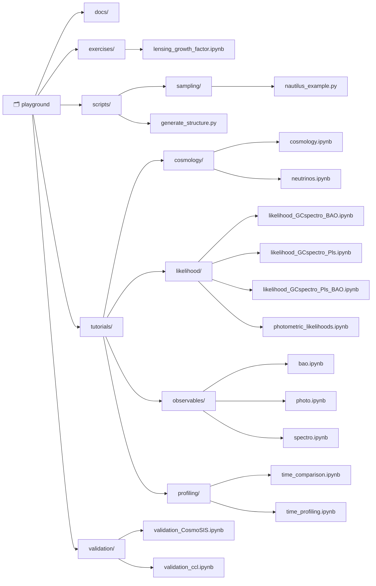

<p align="center">
  
</p>


**Playground repository of the [`cloe` organisation](https://github.com/cloe-org)! 🚀**

This repository serves as a sandbox for tutorials, exercises, and validation for various features, scripts, and models related to `cloelib` and `cloelike`. It provides an open space to learn quickly how to get around the `cloe` organisation.

To explore the contents of this repository, you may need to download synthetic example data available at [Zenodo – cloe-org Community](https://zenodo.org/communities/cloe-org/records).

The data can be read using the [`euclidlib`](https://euclidlib.readthedocs.io/en/latest) library.

Happy learning! 🎉

## 📦 Installation
To use this repository, clone it, no installation needed!

```bash
git clone https://github.com/cloe-org/playground.git
cd playground
```

It might require as dependencies `cloelib`, `cloelike`, `euclidlib` and others.

## 🚀 Usage
You can run the provided notebooks for experimentation!

```bash
jupyter notebook tutorials/observables/photo.ipynb
jupyter notebook tutorials/observables/spectro.ipynb
jupyter notebook tutorials/observables/bao.ipynb
```

For **Dark Emulator** (3x2pt, GC, GGL fitting), run the notebooks in `tutorials/dark_emulator/`; for production sampling use `python playground/scripts/sampling/darkemu_3x2pt_full_sampling.py` (from the repo root).

## 📬 Contact
For any questions or discussions, feel free to open an issue or reach out to the [cloe-maintainers](https://github.com/orgs/cloe-org/teams/cloe-maintainers).

## 📂 Structure
The repository is organized as follows:

<!-- REPO-STRUCTURE-START -->

<!-- REPO-STRUCTURE-END -->

## 🤝 Contributing
This project follows the [all-contributors](https://allcontributors.org) specification. Contributions of any kind welcome!

Thanks goes to these wonderful people ([emoji key](https://allcontributors.org/docs/en/emoji-key)):

<!-- ALL-CONTRIBUTORS-LIST:START - Do not remove or modify this section -->
<!-- prettier-ignore-start -->
<!-- markdownlint-disable -->
<table>
  <tbody>
    <tr>
      <td align="center" valign="top" width="14.28%"><a href="http://gcanasherrera.com"><br /><sub><b>Guadalupe Cañas-Herrera</b></sub></a><br /><a href="#code-gcanasherrera" title="Code">💻</a> <a href="#review-gcanasherrera" title="Reviewed Pull Requests">👀</a> <a href="#doc-gcanasherrera" title="Documentation">📖</a> <a href="#example-gcanasherrera" title="Examples">💡</a> <a href="#infra-gcanasherrera" title="Infrastructure (Hosting, Build-Tools, etc)">🚇</a> <a href="#ideas-gcanasherrera" title="Ideas, Planning, & Feedback">🤔</a> <a href="#maintenance-gcanasherrera" title="Maintenance">🚧</a> <a href="#projectManagement-gcanasherrera" title="Project Management">📆</a> <a href="#tutorial-gcanasherrera" title="Tutorials">✅</a></td>
      <td align="center" valign="top" width="14.28%"><a href="https://github.com/chiaramoretti"><br /><sub><b>Chiara Moretti</b></sub></a><br /><a href="#code-chiaramoretti" title="Code">💻</a> <a href="#review-chiaramoretti" title="Reviewed Pull Requests">👀</a> <a href="#maintenance-chiaramoretti" title="Maintenance">🚧</a> <a href="#tutorial-chiaramoretti" title="Tutorials">✅</a></td>
      <td align="center" valign="top" width="14.28%"><a href="https://github.com/AndreaPezzotta"><br /><sub><b>AndreaPezzotta</b></sub></a><br /><a href="#code-AndreaPezzotta" title="Code">💻</a> <a href="#review-AndreaPezzotta" title="Reviewed Pull Requests">👀</a> <a href="#maintenance-AndreaPezzotta" title="Maintenance">🚧</a> <a href="#tutorial-AndreaPezzotta" title="Tutorials">✅</a></td>
      <td align="center" valign="top" width="14.28%"><a href="https://github.com/PedroCarrilho"><br /><sub><b>Pedro Carrilho</b></sub></a><br /><a href="#code-PedroCarrilho" title="Code">💻</a> <a href="#review-PedroCarrilho" title="Reviewed Pull Requests">👀</a> <a href="#maintenance-PedroCarrilho" title="Maintenance">🚧</a> <a href="#tutorial-PedroCarrilho" title="Tutorials">✅</a> <a href="#ideas-PedroCarrilho" title="Ideas, Planning, & Feedback">🤔</a></td>
      <td align="center" valign="top" width="14.28%"><a href="http://www.cosmostat.org/people/santiago-casas"><br /><sub><b>Santiago Casas</b></sub></a><br /><a href="#code-santiagocasas" title="Code">💻</a> <a href="#review-santiagocasas" title="Reviewed Pull Requests">👀</a></td>
      <td align="center" valign="top" width="14.28%"><a href="https://github.com/josecolomanadal"><br /><sub><b>Jose Coloma Nadal</b></sub></a><br /><a href="#code-josecolomanadal" title="Code">💻</a> <a href="#tutorial-josecolomanadal" title="Tutorials">✅</a> <a href="#bug-josecolomanadal" title="Bug reports">🐛</a></td>
      <td align="center" valign="top" width="14.28%"><a href="https://github.com/llinke1"><br /><sub><b>Laila Linke</b></sub></a><br /><a href="#code-llinke1" title="Code">💻</a> <a href="#tutorial-llinke1" title="Tutorials">✅</a></td>
    </tr>
    <tr>
      <td align="center" valign="top" width="14.28%"><a href="https://github.com/itutusaus"><br /><sub><b>itutusaus</b></sub></a><br /><a href="#code-itutusaus" title="Code">💻</a> <a href="#review-itutusaus" title="Reviewed Pull Requests">👀</a></td>
      <td align="center" valign="top" width="14.28%"><a href="https://github.com/ippoppi"><br /><sub><b>Filippo Oppizzi</b></sub></a><br /><a href="#code-ippoppi" title="Code">💻</a> <a href="#ideas-ippoppi" title="Ideas, Planning, & Feedback">🤔</a> <a href="#tool-ippoppi" title="Tools">🔧</a></td>
      <td align="center" valign="top" width="14.28%"><a href="https://marcobonici.github.io/"><br /><sub><b>Marco Bonici</b></sub></a><br /><a href="#code-marcobonici" title="Code">💻</a> <a href="#ideas-marcobonici" title="Ideas, Planning, & Feedback">🤔</a></td>
      <td align="center" valign="top" width="14.28%"><a href="https://github.com/zahrabaghkhani"><br /><sub><b>Zahra Baghkhani</b></sub></a><br /><a href="#code-zahrabaghkhani" title="Code">💻</a> <a href="#doc-zahrabaghkhani" title="Documentation">📖</a> <a href="#ideas-zahrabaghkhani" title="Ideas, Planning, & Feedback">🤔</a> <a href="#bug-zahrabaghkhani" title="Bug reports">🐛</a></td>
      <td align="center" valign="top" width="14.28%"><a href="http://arthurmloureiro.github.io"><br /><sub><b>Arthur Loureiro</b></sub></a><br /><a href="#doc-arthurmloureiro" title="Documentation">📖</a> <a href="#code-arthurmloureiro" title="Code">💻</a> <a href="#ideas-arthurmloureiro" title="Ideas, Planning, & Feedback">🤔</a></td>
      <td align="center" valign="top" width="14.28%"><a href="https://github.com/KlaraBertmann"><br /><sub><b>KlaraBertmann</b></sub></a><br /><a href="#doc-KlaraBertmann" title="Documentation">📖</a> <a href="#ideas-KlaraBertmann" title="Ideas, Planning, & Feedback">🤔</a></td>
      <td align="center" valign="top" width="14.28%"><a href="https://github.com/jipdebuck"><br /><sub><b>Jip de Buck</b></sub></a><br /><a href="#bug-jipdebuck" title="Bug reports">🐛</a></td>
    </tr>
    <tr>
      <td align="center" valign="top" width="14.28%"><a href="http://ntessore.page"><br /><sub><b>Nicolas Tessore</b></sub></a><br /><a href="#bug-ntessore" title="Bug reports">🐛</a></td>
      <td align="center" valign="top" width="14.28%"><a href="https://github.com/ivansladoljev"><br /><sub><b>Ivan Sladoljev</b></sub></a><br /><a href="#code-ivansladoljev" title="Code">💻</a> <a href="#ideas-ivansladoljev" title="Ideas, Planning, & Feedback">🤔</a></td>
      <td align="center" valign="top" width="14.28%"><a href="https://github.com/ytchang05"><br /><sub><b>Yu-Ting</b></sub></a><br /><a href="#code-ytchang05" title="Code">💻</a> <a href="#bug-ytchang05" title="Bug reports">🐛</a></td>
    </tr>
  </tbody>
</table>

<!-- markdownlint-restore -->
<!-- prettier-ignore-end -->

<!-- ALL-CONTRIBUTORS-LIST:END -->

